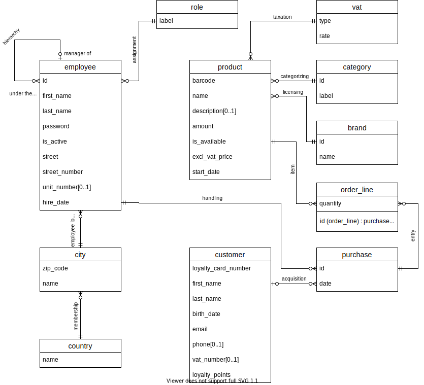
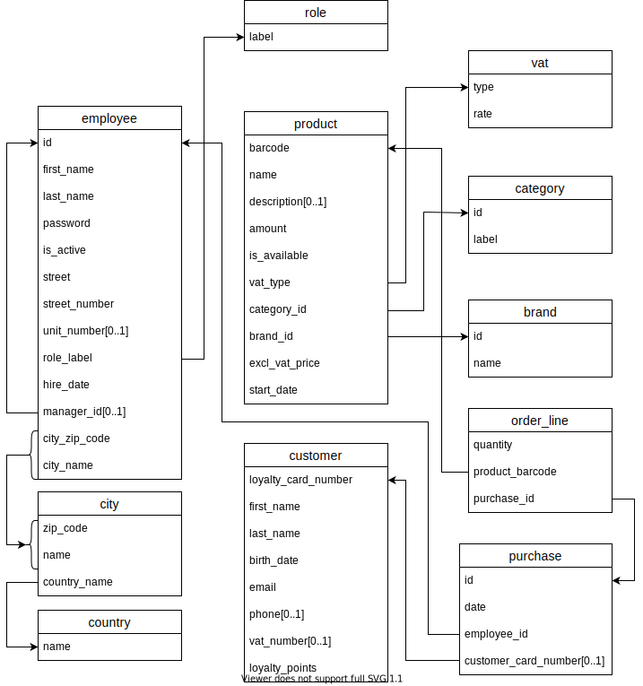

<h1 align="center">Le P'tit Bazar<br>a store management software using Java & SQL</h1>

> [!NOTE]
> Readme également disponible en [français](README_FR.md)

## About

This project, developed in both Java and SQL (PostgreSQL), is a medium-sized grocery store management software.
It allows for stock management, customer management (loyalty program, etc.), and employee management (by the manager).

## Roadmap

A roadmap with features to be implemented and progress is available [here](roadmap.md) (in French only).

## Table of contents

1. [About](#about)
2. [Roadmap](#roadmap)
3. [Table of contents](#table-of-contents)
4. [Installation](#installation)
   - [Prerequisites](#prerequisites)
   - [Build](#build)
5. [Usage](#usage)
6. [Technological stack](#technological-stack)
   - [Development](#development)
   - [Dependencies](#dependencies)
   - [User interface (GUI)](#user-interface-gui)
   - [Database](#database)
   - [Design](#design)
7. [Database structure](#database-structure)
8. [License information](#license-information)

## Installation

### Prerequisites

- Java 11 or higher (JDK)
- Docker (for the database)

### Build

1. **Clone the repository**

   ```bash
   git clone https://github.com/maxoux53/projet-Java.git
   cd projet-Java
   ```

2. **Set up environment variables**  
   Configure the following variables:
   - `PG_USER`: Database username
   - `PG_PASSWORD`: User password for the database
   - `PG_DB`: Database name

   You can use the [`.env` template file](./example.env), simply rename it to .env and edit the values as wanted.

3. **Database configuration**
   - Use the compose command to create the PostgreSQL container

      ```bash
      docker compose up -d
      ```

   - Run [this SQL script](./sql/DB_INIT_TABLES.sql) to create the database structure.

4. **Run the software**
   - Open the project in IntelliJ
   - Run the `Main` class to start the app

   You can also compile the project yourself with `javac`.

## Usage

(...)

## Technological stack

### Development

- Java
- OpenJDK
- IntelliJ build system

### Dependencies

- [Dotenv](https://github.com/cdimascio/dotenv-java)
- [PostgreSQL JDBC Driver](https://github.com/pgjdbc/pgjdbc)

### User interface (GUI)

- JFC Swing
- AWT

### Database

- PostgreSQL
- Docker
- DataGrip & Azure Data Studio (for development)

### Design

- PlantUML to model the object-oriented design (class diagram)
- Draw.io for the database design (ER & relational schemas)

## Database structure

> [!IMPORTANT]
> Schemas are only visible with the **light theme**!

**Entity-Relationship (ER) diagram**


**Relational schema**


## License information

## Contribution and credit

This project is developed by [Constant B.](https://github.com/Zencaaw/), [Adrien D.](https://github.com/Tropicooooo/) and [Max N.](https://github.com/maxoux53/) as part of the 'Programmation orientée objet avancée' (Advanced Object-Oriented Programming) course (IG252).  
The project name is inspired by Tisdo's illustrious [Grand Bazar](https://github.com/Tisdax/grand-bazar).

## License

*This project is licensed under the GNU GPL v3. For more details, please refer to the [LICENSE](LICENSE) file.*
