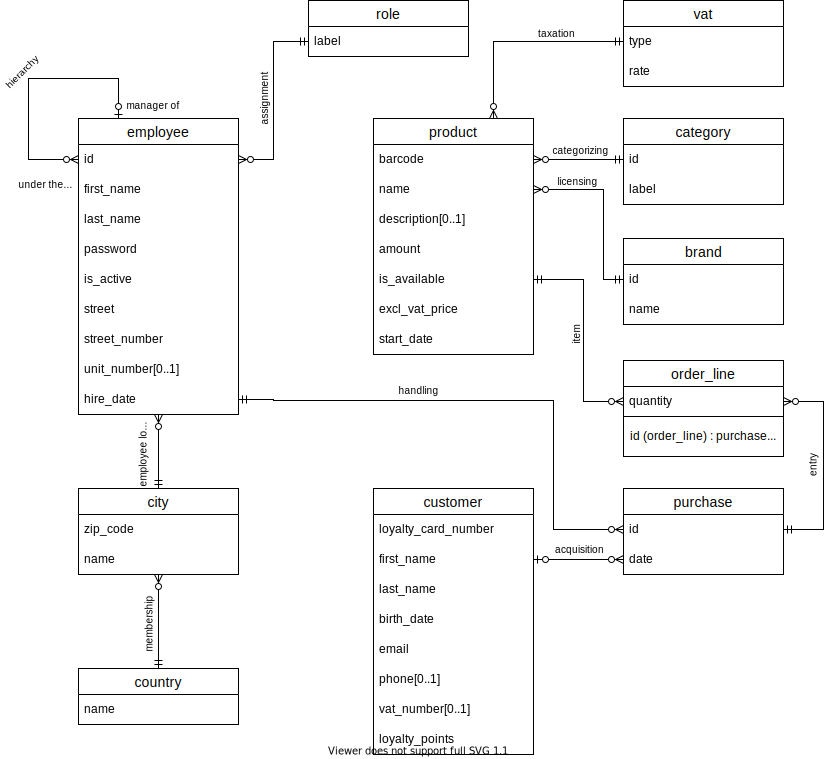
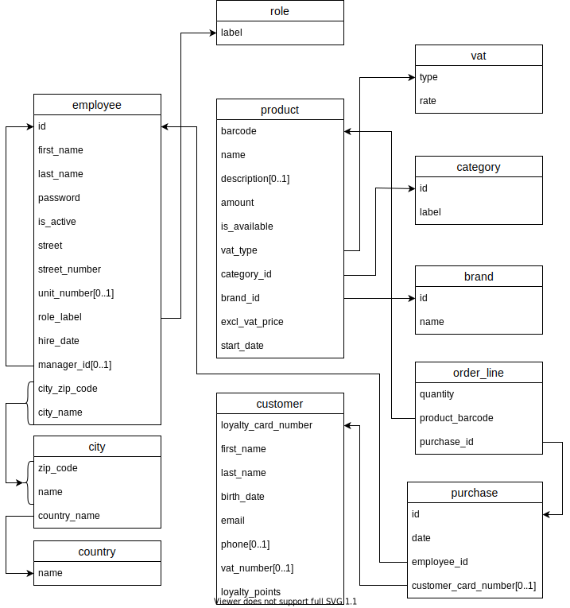

<h1 align="center">Le P'tit Bazar<br>un projet de gestion de magasin en Java & SQL</h1>

> [!NOTE]
> Readme available in [English](README.md) too

## À propos

Notre projet, réalisé en Java et SQL (PostgreSQL), est un logiciel de gestion de magasin d'alimentation généraliste.
Il permet la gestion des stocks, la gestion client (programme de fidélité, etc), la gestion des employés (par le manager).

## Feuille de route

Une feuille de route avec les fonctionnalités à implémenter et leur avancement est disponible [ici](roadmap.md).

## Table des matières

1. [À propos](#à-propos)
2. [Feuille de route](#feuille-de-route)
3. [Table des matières](#table-des-matières)
4. [Installation](#installation)
   - [Prérequis](#prérequis)
   - [Build](#build)
5. [Utilisation](#utilisation)
6. [Technologies utilisées](#technologies-utilisées)
   - [Développement](#développement)
   - [Dépendances](#dépendances)
   - [Interface utilisateur](#interface-utilisateur)
   - [Base de données](#base-de-données)
   - [Conception](#conception)
7. [Structure de la base de données](#structure-de-la-base-de-données)
8. [Informations sur la licence](#informations-sur-la-licence)

## Installation

### Prérequis

- Java 11 ou supérieur (JDK)
- Docker (pour la base de données)

### Build

1. **Cloner le dépôt**

   ```bash
   git clone https://github.com/maxoux53/petit-bazar.git
   cd petit-bazar
   ```

2. **Configurer les variables d'environnement**  
   Configurer les variables :
   - `PG_USER`: Nom d'utilisateur pour la base de données
   - `PG_PASSWORD`: Mot de passe pour la base de données
   - `PG_DB`: Nom de la base de données
   - `STORE_NAME`: Nom du magasin (affiché dans l'interface graphique)

   Possibilité d'utiliser le [fichier d'exemple `.env`](./example.env). Le renommer en .env et modifier les valeurs comme souhaité.

3. **Configuration de la base de données**
   - Utiliser la commande compose pour créer le conteneur PostgreSQL

      ```bash
      docker compose up -d
      ```

4. **Lancer l'application**
   - Ouvrir le projet dans IntelliJ
   - Lancer la classe `Main` pour démarrer l'application

   Possibilité de compiler le projet soi-même avec `javac`.

## Utilisation

(...)

## Technologies utilisées

### Développement

- Java
- OpenJDK
- Système de build IntelliJ

### Dépendances

- [Dotenv](https://github.com/cdimascio/dotenv-java)
- [Pilote JDBC PostgreSQL](https://github.com/pgjdbc/pgjdbc)

### Interface utilisateur

- JFC Swing
- AWT

### Base de données

- PostgreSQL
- Docker
- DataGrip & Azure Data Studio (pour le développement)

### Conception

- Draw.io pour la modélisation de la base de données (EA + relationnel).

## Structure de la base de données

> [!IMPORTANT]
> Schémas uniquement visibles avec l'interface en **thème clair** !

**Schema entité-association (EA)**  


**Schema relationnel**  


## Informations sur la licence

### Contributions et crédits

Ce projet est réalisé par [Constant B.](https://github.com/Zencaaw/), [Adrien D.](https://github.com/Tropicooooo/) et [Max N.](https://github.com/maxoux53/) dans le cadre du cours de Programmation orientée objet avancée (IG252).  
Nom inspiré de l'illustre [Grand Bazar](https://github.com/Tisdax/grand-bazar) par Tisdo.

### Licence

*Ce projet est sous licence GNU GPL v3. Pour plus de détails, veuillez consulter le fichier [LICENSE](LICENSE).*
